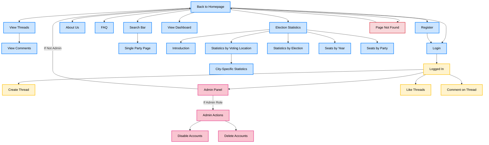

[Het diagram in Mermaid](https://mermaid.live/edit#pako:eNqVVWtvozgU_SsWo5F2JaeCkBTKSCMloY902k6a9O3MBwdfEqsEZ43ZmWzb_74GEwLVrFbNhwjuOT73-txr_GJFgoEVWEtJNyt0E85TpH-fP6NJvkh4hAZRBFlmogNyJtawoUv4gTqdr2hI7jj8RDcrCZRlPwxpWEJPBhqJ9RpStcMGJTYiF2LJ01YsJFNY8kyBbIWPyWAhcoVu2won5GRw3Yo8kBlQGa3QkO4UHkrgkcx4ukwATahUW_2vi28uHJtCQ5qtFoJKpsHagl1JSAlUlmyQ8N0uGvy_ci4ha5JHJfm0IC-BofFu26dl_IyMtHcKKg9b2DkZsDVPdckpJC3kG7ngz_DOdwNdkMpyJNK9aF2hUWz29LxY9jqOK2gqEnhFl2RHVFykuww19UooQ3_VIzGk0XNhUD0ahnxZlnNFQp7RhbZf5xT5fhIM_J2EkIBqoXWtxwmU6dFMUaX7wKMM_WFK54Wiznn8N8itSOHPZkcn5Dcrq7STknFNxqmSguUlqwVNSSPbYovuhNLjoxsa0QZ3WnJnZMTVtjPbQMRjfVT-I9vNO8lddS3SbTG_qsQfoR5hg93tsXKImyYVrTjR1rGmA_ekGPM9Vqndl-BvO1brzdQ2KTYcC4mihEq9QYPplywLIUYb812IeZIEn3Q3-nGMM-3mMwSfbNtb1K-dn5ypVdDd_MKRSIQsYPvLOzV9WpTkkdJHwyjGcexGrFaM48ixvY8o0nJyK7GjqM-cWgx8F_zoI2JJcZArMdYDxmgt1vWp1-t_RAyk1K5WlfnMa4ixyO3_r9j-FOsTsEyLNmW6XZA18qABHuIRDvExPsFjPMHXeIpn-Abf6uc7_FS1r1kaOsVn-Bu-aPSiBZ_jS3yFvxtjW8i92VIr9oAf9zksbK1Briln-oZ5KWhzS61gDXMr0I-Myue5NU_fNI_mSsy2aWQFSuaArXzD9Hcx5FRfTOtdEBhXQl6aG6u8uLC1oemTEJoS0yTTHCny5ap-06gVvFi_rKDjeAe-e-Q4tuP6nuf5Dra2VuD27QOn77i27xwe2d2u13vD1j-loHNg9-yu2-sf9j235x-67tu_VZk5KQ) toont een visueel overzicht van de navigatie- en toegangspaden binnen een website die verschillende functionaliteiten biedt, zoals gebruikersregistratie, inloggen, en toegang tot openbare en beheerdersspecifieke secties.

Beschrijving van de onderdelen:

Public Access: Dit zijn de secties van de website die toegankelijk zijn voor iedereen, zoals de homepage, het bekijken van threads, en verkiezingsstatistieken. Gebruikers kunnen ook zoeken en naar de 'Single Party Page' navigeren.

Login en Registratie: Gebruikers kunnen zich registreren of inloggen op de website. Na inloggen krijgen ze toegang tot beperkte functies zoals het creëren van threads en het reageren op threads.

Beheerderstoegang: Alleen gebruikers met beheerdersrechten kunnen toegang krijgen tot de admin panel, waar ze acties kunnen ondernemen zoals het uitschakelen of verwijderen van accounts.

Verkiezingsstatistieken: Deze sectie biedt gedetailleerde informatie over verkiezingen, zoals statistieken per locatie, per verkiezing en zetels per partij, wat beschikbaar is voor alle gebruikers.

Foutpagina: Wanneer een gebruiker een niet-bestaande pagina bezoekt, wordt deze doorverwezen naar de homepage.

Stijlen: Verschillende secties van de website zijn gecategoriseerd met kleurcodes om duidelijk aan te geven welke secties openbaar, ingelogd, of administratief zijn, evenals een foutpagina-indicator.

Dit diagram biedt een duidelijk overzicht van de gebruikersinteracties en toegangsbeperkingen binnen de website.