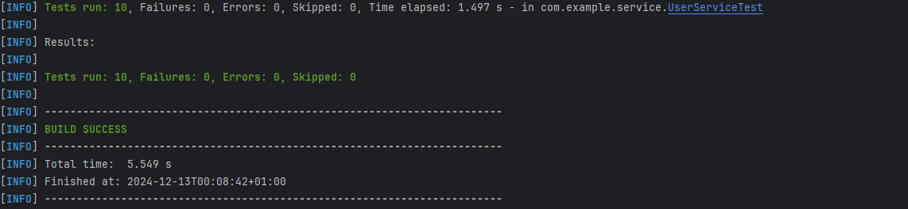

# Register Testen in het Election Project

Dit document legt de verschillende tests uit die betrekking hebben op de registratie- en authenticatiefuncties in de `UserService`. Deze tests controleren de werking van de gebruikersauthenticatie, het registreren van gebruikers, het wijzigen van de status van gebruikers, en het verwijderen van gebruikers.

## Testen in de `UserService`

De `UserService` bevat de volgende belangrijke functies die we testen:

- **authenticate** – Gebruiker authenticeren met e-mail en wachtwoord, en een JWT-token genereren.
- **saveUser** – Nieuwe gebruiker opslaan in de database.
- **existsByEmail** – Controleren of een e-mail al bestaat in de database.
- **existsByUsername** – Controleren of een gebruikersnaam al bestaat in de database.
- **toggleActiveStatus** – De status van een gebruiker in- of uitschakelen (actief of inactief).
- **deleteUser** – Een gebruiker verwijderen uit de database.

### 1. **Testen van `authenticate`**

#### a. **`testAuthenticateSuccess`**
- **Doel**: Test de succesvolle authenticatie van een gebruiker.
- **Beschrijving**: Deze test simuleert het scenario waarin de gebruiker succesvol wordt geauthenticeerd met een geldige e-mail en wachtwoord. Het JWT-token wordt gegenereerd.
- **Verwachte Uitkomst**: Een geldig token wordt gegenereerd, en de `generateToken` methode van `JwtUtil` wordt één keer aangeroepen.

#### b. **`testAuthenticateInvalidPassword`**
- **Doel**: Test het geval van een onjuist wachtwoord.
- **Beschrijving**: Deze test simuleert het scenario waarin een gebruiker probeert in te loggen met een onjuist wachtwoord. Er wordt geen token gegenereerd.
- **Verwachte Uitkomst**: Het token is `null` en de `generateToken` methode van `JwtUtil` wordt niet aangeroepen.

#### c. **`testAuthenticateUserNotFound`**
- **Doel**: Test het geval van een niet-bestaande gebruiker.
- **Beschrijving**: Deze test simuleert het scenario waarin een gebruiker probeert in te loggen met een niet-bestaand e-mailadres. Er wordt geen token gegenereerd.
- **Verwachte Uitkomst**: Het token is `null` en de `generateToken` methode van `JwtUtil` wordt niet aangeroepen.

### 2. **Testen van `saveUser`**

#### d. **`testSaveUser`**
- **Doel**: Test het opslaan van een nieuwe gebruiker.
- **Beschrijving**: Deze test simuleert het scenario waarin een nieuwe gebruiker wordt opgeslagen in de database. De methode `saveUser` roept de `save` methode van de `UserRepository` aan.
- **Verwachte Uitkomst**: De `save` methode van `UserRepository` wordt één keer aangeroepen.

### 3. **Testen van `existsByEmail`**

#### e. **`testExistsByEmail`**
- **Doel**: Test het controleren van het bestaan van een e-mail in de database.
- **Beschrijving**: Deze test simuleert het geval waarin gecontroleerd wordt of een gebruiker met een bepaalde e-mail al bestaat.
- **Verwachte Uitkomst**: De methode retourneert `true` als de e-mail al bestaat, en de `existsByEmail` methode van `UserRepository` wordt één keer aangeroepen.

### 4. **Testen van `existsByUsername`**

#### f. **`testExistsByUsername`**
- **Doel**: Test het controleren van het bestaan van een gebruikersnaam in de database.
- **Beschrijving**: Deze test simuleert het geval waarin gecontroleerd wordt of een gebruiker met een bepaalde gebruikersnaam al bestaat.
- **Verwachte Uitkomst**: De methode retourneert `true` als de gebruikersnaam al bestaat, en de `existsByUsername` methode van `UserRepository` wordt één keer aangeroepen.

### 5. **Testen van `toggleActiveStatus`**

#### g. **`testToggleActiveStatus`**
- **Doel**: Test het in- en uitschakelen van de actieve status van een gebruiker.
- **Beschrijving**: Deze test simuleert het scenario waarin de actieve status van een gebruiker wordt gewijzigd. Als de gebruiker al actief is, wordt de status uitgeschakeld.
- **Verwachte Uitkomst**: De gebruiker wordt succesvol opgeslagen met de gewijzigde actieve status. De `save` methode van `UserRepository` wordt één keer aangeroepen.

#### h. **`testToggleActiveStatusUserNotFound`**
- **Doel**: Test het geval waarin een gebruiker niet wordt gevonden bij het wijzigen van de actieve status.
- **Beschrijving**: Deze test simuleert het scenario waarin geprobeerd wordt de actieve status van een niet-bestaande gebruiker te wijzigen. Er gebeurt geen wijziging in de database.
- **Verwachte Uitkomst**: De gebruiker wordt niet opgeslagen en de `save` methode van `UserRepository` wordt niet aangeroepen.

### 6. **Testen van `deleteUser`**

#### i. **`testDeleteUser`**
- **Doel**: Test het verwijderen van een gebruiker uit de database.
- **Beschrijving**: Deze test simuleert het scenario waarin een bestaande gebruiker wordt verwijderd uit de database.
- **Verwachte Uitkomst**: De gebruiker wordt succesvol verwijderd en de `deleteById` methode van `UserRepository` wordt één keer aangeroepen.

#### j. **`testDeleteUserNotFound`**
- **Doel**: Test het geval waarin geprobeerd wordt een niet-bestaande gebruiker te verwijderen.
- **Beschrijving**: Deze test simuleert het scenario waarin geprobeerd wordt een gebruiker te verwijderen die niet bestaat in de database.
- **Verwachte Uitkomst**: De gebruiker wordt niet verwijderd en de `deleteById` methode van `UserRepository` wordt niet aangeroepen.

---

## Samenvatting van de Testen

Deze tests dekken de belangrijkste functionaliteiten van de `UserService`, zoals authenticatie, gebruikersregistratie, en het beheer van de actieve status en verwijdering van gebruikers. De testen maken gebruik van **Mockito** om de afhankelijkheden van `UserRepository` en `JwtUtil` te mocken, zodat de tests alleen de logica van de `UserService` testen.

- **Authenticatie**: Testen van succesvolle en mislukte inlogpogingen.
- **Registratie**: Testen van het opslaan van nieuwe gebruikers.
- **Gebruikersbeheer**: Testen van functies zoals het controleren van het bestaan van e-mails en gebruikersnamen, het wijzigen van de actieve status van een gebruiker, en het verwijderen van gebruikers.

---

