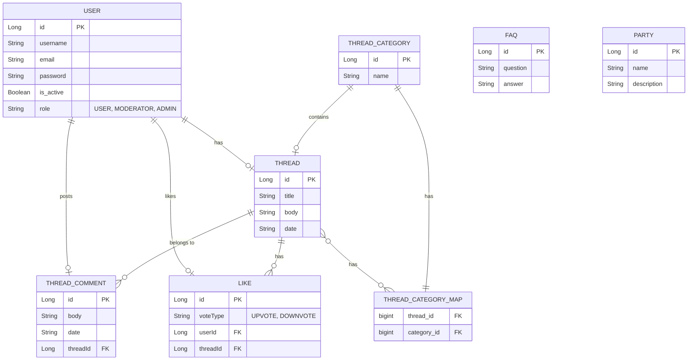

# Database

## Overzicht
Dit document beschrijft de database-structuur van het systeem, inclusief de tabellen en hun relaties. Het datamodel wordt weergegeven met behulp van een Mermaid-diagram.

## Tabellen

### 1. USER
De **USER**-tabel bevat informatie over de gebruikers van het systeem.

| Kolomnaam  | Type     | Beschrijving                           |  
|------------|----------|----------------------------------------|  
| id         | Long     | Unieke ID van de gebruiker (PK).       |  
| username   | String   | Gebruikersnaam van de gebruiker.       |  
| email      | String   | E-mailadres van de gebruiker.          |  
| password   | String   | Wachtwoord van de gebruiker.           |  
| is_active  | Boolean  | Status of de gebruiker actief is.      |  
| role       | String   | Rol van de gebruiker (bijv. USER, MODERATOR, ADMIN). |  

### 2. THREAD
De **THREAD**-tabel bevat discussies of forums waar gebruikers berichten kunnen plaatsen.

| Kolomnaam  | Type     | Beschrijving                           |  
|------------|----------|----------------------------------------|  
| id         | Long     | Unieke ID van de thread (PK).          |  
| title      | String   | Titel van de thread.                   |  
| body       | String   | Inhoud van de thread.                  |  
| date       | String   | Datum waarop de thread is gemaakt.     |  

### 3. THREAD_CATEGORY
De **THREAD_CATEGORY**-tabel bevat categorieën waaraan threads kunnen worden gekoppeld.

| Kolomnaam  | Type     | Beschrijving                           |  
|------------|----------|----------------------------------------|  
| id         | Long     | Unieke ID van de categorie (PK).       |  
| name       | String   | Naam van de categorie.                 |  

### 4. THREAD_COMMENT
De **THREAD_COMMENT**-tabel bevat reacties op threads.

| Kolomnaam  | Type     | Beschrijving                           |  
|------------|----------|----------------------------------------|  
| id         | Long     | Unieke ID van de opmerking (PK).       |  
| body       | String   | Inhoud van de opmerking.               |  
| date       | String   | Datum waarop de opmerking is geplaatst.|  
| threadId   | Long     | Verwijzing naar de bijbehorende thread (FK). |  

### 5. FAQ
De **FAQ**-tabel bevat veelgestelde vragen en antwoorden.

| Kolomnaam  | Type     | Beschrijving                           |  
|------------|----------|----------------------------------------|  
| id         | Long     | Unieke ID van de vraag (PK).           |  
| question   | String   | De veelgestelde vraag.                 |  
| answer     | String   | Het antwoord op de vraag.              |  

### 6. LIKE
De **LIKE**-tabel bevat informatie over stemmen (upvotes of downvotes) door gebruikers.

| Kolomnaam  | Type     | Beschrijving                           |  
|------------|----------|----------------------------------------|  
| id         | Long     | Unieke ID van de stem (PK).            |  
| voteType   | String   | Type stem ("UPVOTE", "DOWNVOTE").      |  
| userId     | Long     | Verwijzing naar de gebruiker die heeft gestemd (FK). |  
| threadId   | Long     | Verwijzing naar de thread waarop is gestemd (FK). |  

### 7. PARTY
De **PARTY**-tabel bevat informatie over politieke partijen.

| Kolomnaam  | Type     | Beschrijving                           |  
|------------|----------|----------------------------------------|  
| id         | Long     | Unieke ID van de partij (PK).          |  
| name       | String   | Naam van de partij.                    |  
| description| String   | Beschrijving van de partij.            |  

### 8. THREAD_CATEGORY_MAP
De **THREAD_CATEGORY_MAP**-tabel bevat de mapping tussen threads en categorieën.

| Kolomnaam     | Type     | Beschrijving                           |  
|---------------|----------|----------------------------------------|  
| thread_id     | bigint   | Verwijzing naar de thread (FK).        |  
| category_id   | bigint   | Verwijzing naar de categorie (FK).     |  

## Relaties

Het onderstaande Mermaid-diagram toont de relaties tussen de tabellen:

### Relaties Uitleg

1. **USER en THREAD**: Een gebruiker kan meerdere threads hebben ("has").
2. **USER en THREAD_COMMENT**: Een gebruiker kan meerdere reacties plaatsen ("posts").
3. **USER en LIKE**: Een gebruiker kan stemmen (upvote of downvote) op meerdere threads ("likes").
4. **THREAD en THREAD_COMMENT**: Een thread kan meerdere reacties bevatten ("belongs to").
5. **THREAD en LIKE**: Een thread kan meerdere stemmen hebben ("has").
6. **THREAD_CATEGORY en THREAD**: Een categorie kan meerdere threads bevatten ("contains").
7. **THREAD en THREAD_CATEGORY_MAP**: Een thread kan deel uitmaken van meerdere categorieën via een mappingtabel.
8. **THREAD_CATEGORY en THREAD_CATEGORY_MAP**: Een categorie kan meerdere threads bevatten via een mappingtabel.

### Conclusie
Het datamodel biedt een uitgebreide en flexibele structuur om gebruikers, threads, reacties, categorieën, stemmen, politieke partijen en veelgestelde vragen te beheren. Het Mermaid-diagram visualiseert duidelijk de relaties tussen de tabellen.  