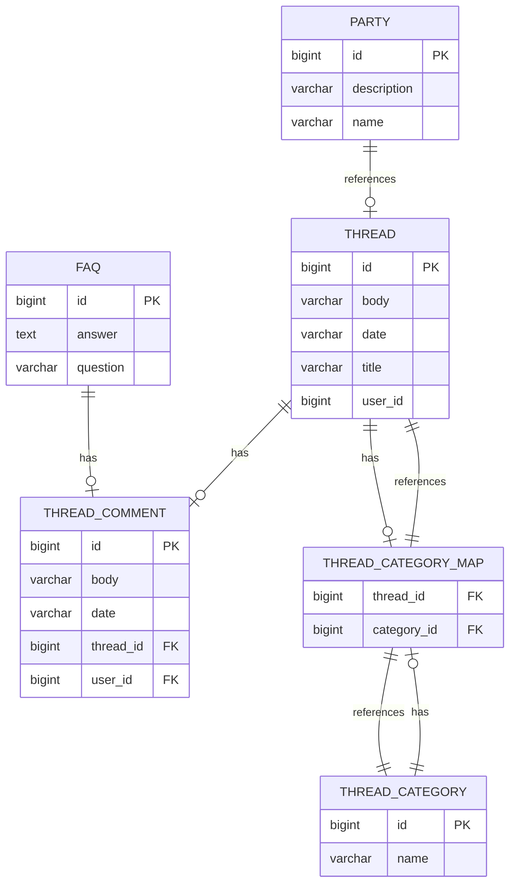

# Database

## Overview
Dit document beschrijft de database structuur van het systeem, inclusief de tabellen en hun relaties. Het datamodel wordt weergegeven met behulp van een Mermaid-diagram.

## Tabellen

### 1. FAQ
De **FAQ**-tabel bevat veelgestelde vragen met bijbehorende antwoorden.

- **id** (bigint, PK): Het unieke identificatienummer van de FAQ.
- **question** (varchar): De vraag die wordt gesteld.
- **answer** (text): Het antwoord op de vraag.

### 2. PARTY
De **PARTY**-tabel bevat informatie over politieke partijen.

- **id** (bigint, PK): Het unieke identificatienummer van de partij.
- **name** (varchar): De naam van de partij.
- **description** (varchar): Een beschrijving van de partij.

### 3. THREAD
De **THREAD**-tabel bevat discussies of forums waar gebruikers berichten kunnen plaatsen.

- **id** (bigint, PK): Het unieke identificatienummer van het bericht.
- **title** (varchar): De titel van het bericht.
- **body** (varchar): De inhoud van het bericht.
- **date** (varchar): De datum waarop het bericht is geplaatst.
- **user_id** (bigint): Het ID van de gebruiker die het bericht heeft geplaatst.

### 4. THREAD_CATEGORY
De **THREAD_CATEGORY**-tabel bevat de verschillende categorieën waartoe een thread kan behoren.

- **id** (bigint, PK): Het unieke identificatienummer van de categorie.
- **name** (varchar): De naam van de categorie.

### 5. THREAD_CATEGORY_MAP
De **THREAD_CATEGORY_MAP**-tabel vormt een veel-op-veel-relatie tussen threads en categorieën. Dit betekent dat een thread meerdere categorieën kan hebben en een categorie meerdere threads kan bevatten.

- **thread_id** (bigint, FK): Het ID van de thread.
- **category_id** (bigint, FK): Het ID van de categorie.

### 6. THREAD_COMMENT
De **THREAD_COMMENT**-tabel bevat de reacties op threads.

- **id** (bigint, PK): Het unieke identificatienummer van de reactie.
- **body** (varchar): De inhoud van de reactie.
- **date** (varchar): De datum waarop de reactie is geplaatst.
- **thread_id** (bigint, FK): Het ID van de thread waar de reactie op is geplaatst.
- **user_id** (bigint, FK): Het ID van de gebruiker die de reactie heeft geplaatst.

## Relaties

Het onderstaande Mermaid-diagram toont de relaties tussen de tabellen:

### Relaties Uitleg:

1. **FAQ - THREAD_COMMENT**:
    - Een FAQ kan meerdere reacties hebben, en elke reactie kan naar één FAQ verwijzen.

2. **THREAD - THREAD_COMMENT**:
    - Een thread kan meerdere reacties hebben, en elke reactie behoort tot één thread.

3. **THREAD - THREAD_CATEGORY_MAP**:
    - Een thread kan meerdere categorieën hebben, en elke categorie kan meerdere threads bevatten.

4. **THREAD_CATEGORY - THREAD_CATEGORY_MAP**:
    - Een categorie kan meerdere threads bevatten, en een thread kan meerdere categorieën hebben.

5. **PARTY - THREAD**:
    - Een politieke partij kan verbonden zijn met meerdere threads.

### Conclusie
Dit model zorgt ervoor dat we effectief informatie over threads, reacties, categorieën en politieke partijen kunnen beheren en de relaties tussen deze entiteiten vast kunnen leggen.