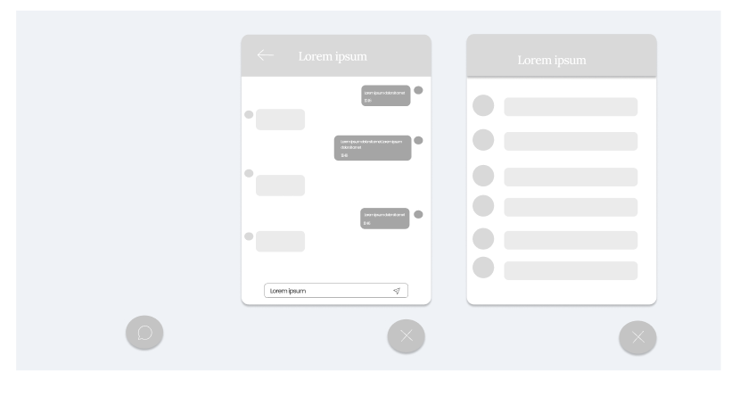

# Chat Function

The **Chat Function** provides users with the ability to engage in live discussions about the elections. Available to logged-in users, the chat feature is accessible through a floating button located at the bottom right of the page.

## Chat Features

- **Chat Button:**
  - Located at the **bottom right** of the screen, a small chat icon or button is visible to logged-in users.
  - Clicking the button expands the chat window, allowing users to interact in real-time with others.
  - When collapsed, the button remains visible for easy access without interfering with the overall dashboard experience.

- **Expanded Chat Window:**
  - Once clicked, the chat window expands into a **small pop-up** section on the lower portion of the screen.
  - **User List:** A list of active users currently online and available to chat about the elections.
  - **Chat Messages:** A scrollable section displaying live messages from all participants, allowing users to follow the conversation.
  
- **Message Input Box:**
  - At the bottom of the expanded chat, users can type their messages in a text input field.
  - A **Send Button** allows users to submit their messages. Pressing "Enter" also sends the message.
  
- **Features within Chat:**
  - **Emojis and Reactions:** Users can include emojis in their messages to express opinions on the ongoing election conversation.
  - **Reply to Messages:** Users can reply to specific messages within the chat to keep discussions organized.
  - **Mentions:** Users can tag other participants in the conversation using an "@" symbol followed by their username, helping direct conversations.

- **Moderation:**
  - **Chat Guidelines:** A short set of rules or guidelines on respectful conversation to ensure a healthy discussion.
  - **Report Feature:** Users can report inappropriate messages to moderators, ensuring a safe chat environment.

- **Notifications:**
  - When the chat is minimized, users may receive small notification badges or sounds when new messages are received.
  - **Mute Option:** Users can mute notifications if they do not want to receive alerts while focusing on the election results.

This chat function allows users to discuss live election results, share opinions, ask questions, and interact with others in real-time, fostering a community around the ongoing elections.