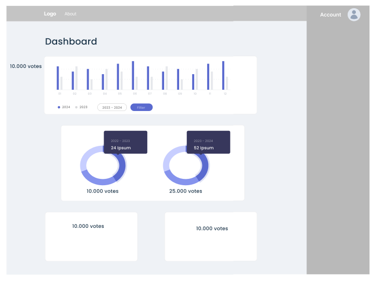

# Election Dashboard

The **Election Dashboard** provides a comprehensive overview of the election results, represented visually through charts and diagrams. Users can filter results based on specific parameters like candidate, region, or voting demographics.

## Dashboard Features

- **Results Overview:**
  - **Total Votes:** A summary of the total number of votes cast in the election.
  - **Leading Candidate:** A highlighted section showing the current leading candidate based on the votes counted so far.
  - **Vote Breakdown:** A quick breakdown of the vote percentage for the top candidates.

- **Charts and Diagrams:**
  - **Bar Charts:** Displaying vote distribution among candidates, with clear labeling for vote counts and percentage.
  - **Pie Charts:** Visualizing the proportion of votes for each candidate as part of the total votes.
  - **Line Graphs:** Tracking the progression of votes counted over time for different regions or voting districts.

- **Filter Options:**
  - **By Candidate:** A dropdown menu allowing users to filter the results by specific candidates.
  - **By Region:** Users can filter results based on geographic regions (e.g., state, county, district).
  - **By Voting Method:** Filters to view results by in-person voting, absentee ballots, or mail-in voting.
  - **By Demographic:** Advanced filtering options to view how different demographic groups (age, gender, etc.) voted.

- **Map Visualization:** 
  - An interactive map that shows regional voting results with color-coded regions representing the leading candidate in each area.

This dashboard offers users an intuitive and interactive experience to track election outcomes and analyze trends in real time, based on various filtering and visualization options.