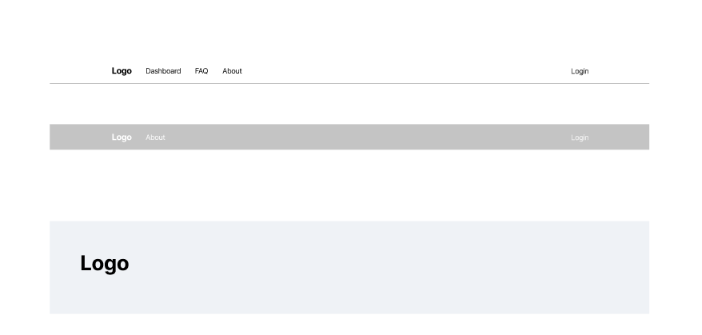

# Header and Footer

## Header

The **Header** of the website serves as a primary navigation tool for users, providing essential links and options depending on their login status.

### Key Features:

- **Logo:** Displays the website's logo prominently, linking back to the homepage when clicked.
  
- **Navigation Links:** 
  - For **logged-out users**:
    - **Home:** Links to the homepage, where users can find general information and the latest updates.
    - **About:** Directs users to a page that provides details about the website's purpose and mission.
    - **FAQ:** A link to the Frequently Asked Questions page, assisting users with common inquiries.
    - **Login:** A link for users to access their accounts or create a new one.

  - For **logged-in users**:
    - **Profile:** Replaces the Login link, allowing users to view and edit their account details.
    - **Dashboard:** Provides quick access to the election results dashboard, where users can view live data and charts.
    - **Chat:** Links to the chat function, enabling users to engage in discussions about the elections.

### Layout:
- The header remains consistent across all pages, providing users with reliable navigation no matter where they are on the site.

---

## Footer

The **Footer** serves as a secondary navigation tool, helping users move between different sections of the site.

### Key Features:

- **Consistent Navigation:** 
  - The footer includes links to various pages such as:
    - **Home**
    - **About**
    - **FAQ**
    - **Contact Us** (if applicable)
    - **Privacy Policy**
    - **Terms of Service**

- **Accessibility:** 
  - The footer remains unchanged regardless of the user's login status, ensuring that all users have the same access to essential pages at any time.

### Layout:
- Positioned at the bottom of every page, the footer provides users with a seamless way to navigate without cluttering the main content area.

---

This structure helps maintain a clear and intuitive navigation experience for both logged-in and logged-out users, enhancing usability while browsing the website.
