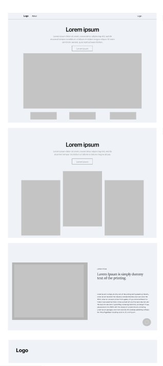

# Homepage - Election Results Website

The homepage of the "Election Results" website is designed with a simple and clean layout, where the most important information is centralized. The page is divided into several sections, each serving a clear purpose.

## Hero Section

- **Title:** The hero section features a prominent "Lorem ipsum" title, leaving space for a key message about the website or its purpose.
- **Description:** Below the title is a brief summary of what the site offers, such as election information and results.
- **CTA Button:** A clear "Learn more" button is centered to guide users to more detailed information about election results or related topics.
- **Image:** There is space for a large image or graphic to visually represent results or important election-related information.

## Section 1 - Featured Information

- **Tiles:** Directly below the hero section, there are three visual tiles, which can be used to highlight key topics or featured election data. These could be links to specific elections, parties, or important updates.

## Section 2 - Categories

- **Information Blocks:** This section presents three blocks with additional information, such as results by region, districts, or specific candidate profiles. Each block is clickable and leads users to more detailed information.
- **CTA Button:** Again, there is a "Learn more" button for users to explore further details.

## Section 3 - Articles or News

- **Lorem Ipsum Article:** This section provides space for a featured article or news section about recent election developments, including an image and brief summary. It can cover topics such as analysis, results, or commentary.
- **Summary:** A short description next to the image gives visitors a quick overview of the content.