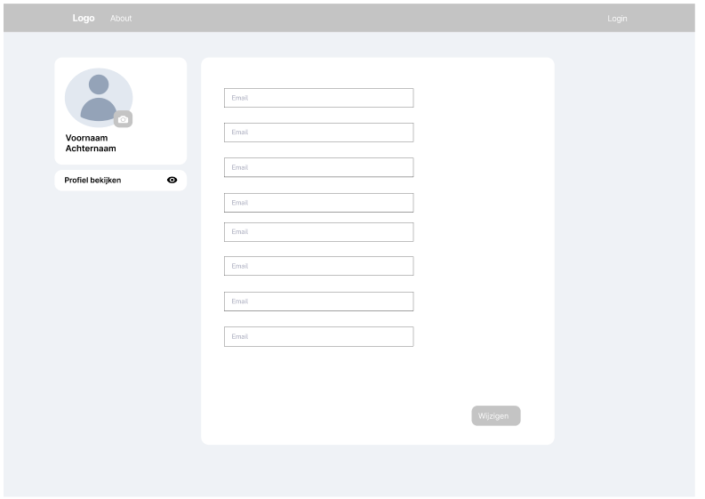

# Profile Page

The **Profile Page** allows logged-in users to view and edit their personal information, such as their username and password.

## Page Features

- **Profile Overview:**
  - **Username:** Displayed at the top of the profile page, with an option to edit.
  - **Email:** The registered email address is displayed.
  - **Profile Picture (optional):** A section for the user to upload or change their profile picture.
  
- **Editable Sections:**
  - **Change Username:** A text input field where users can update their username.
  - **Change Password:** Fields for entering a new password and confirming it to update their password.
  
- **Save Changes Button:** A prominent button at the bottom of the editable sections allowing users to save their changes.

- **Logout Option:** 
  - Either in the header or at the bottom of the page, a clear "Logout" option to allow users to securely log out of their account.

---

This page ensures that users can easily manage their account details and make updates to their information when necessary.