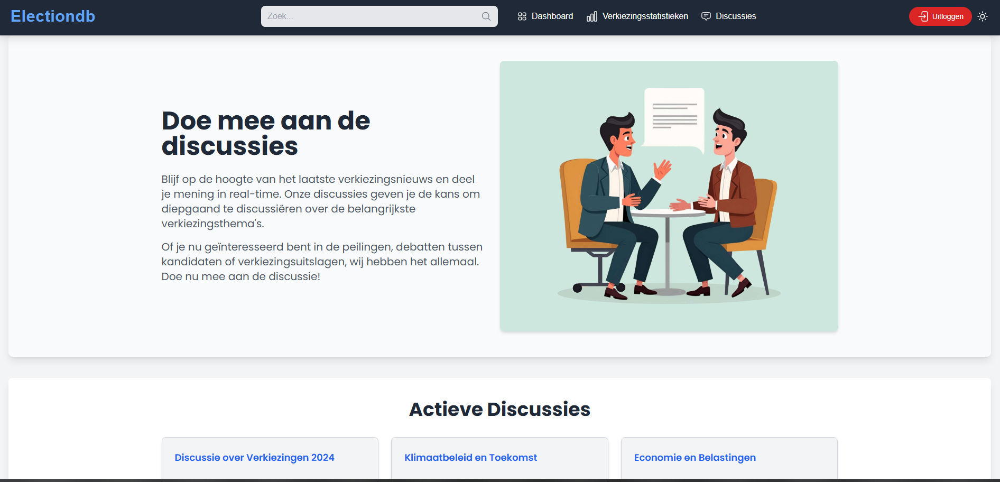
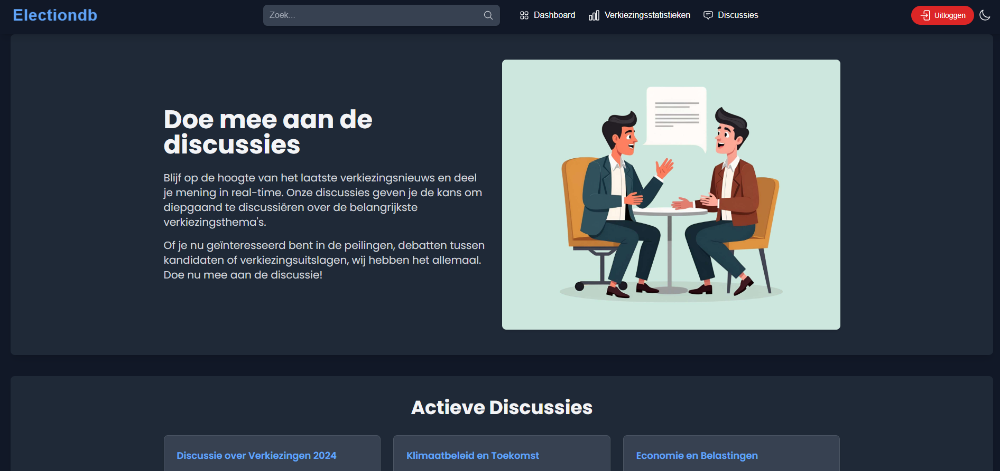

### **Energy Efficiency and Sustainability of Dark Mode**

Dark mode not only provides a visually appealing option for many users, but it also offers significant benefits in terms of energy consumption and sustainability.

## **Technical Aspects of Sustainability**

Enabling dark mode can reduce the energy consumption of a website, especially on devices with OLED or AMOLED screens. These screen technologies light up individual pixels when they need to display light, while dark pixels consume no energy. This means that in dark mode, the energy required to display a page can be considerably lower.

By integrating **TailwindCSS's dark mode** functionality, we can easily leverage this energy efficiency. The `class`-based mode ensures that the mode is dynamically adjusted according to the user's preference, without affecting the page's performance. Additionally, users can toggle this mode using a button, enabling them to switch between modes based on their interaction.

## **Benefits for Sustainability**

- **Energy Saving**: As mentioned, with OLED and AMOLED screens, dark pixels significantly reduce energy consumption, resulting in extended battery life and reduced power use.
- **Reduced Carbon Emissions**: By consuming less energy, the overall ecological footprint of devices with high energy consumption, such as smartphones, can be reduced.
- **Lower Energy Consumption at Low Brightness**: Even on LCD screens, where the energy benefits are less noticeable than on OLED displays, dark mode can contribute to lower energy consumption at lower brightness settings.

## **Visual and Functional Aspects**

Dark mode not only offers an energy-saving advantage but is also preferred by many users due to reduced eye strain in low-light environments. This makes the interface more user-friendly and comfortable for longer sessions.

## **Conclusion**

By offering dark mode in our web application, we provide users with not only a visual experience they prefer but also contribute to energy efficiency and sustainability. Using dark mode helps reduce energy consumption and, over time, can contribute to lowering carbon emissions, which is an important step toward a more sustainable digital world.