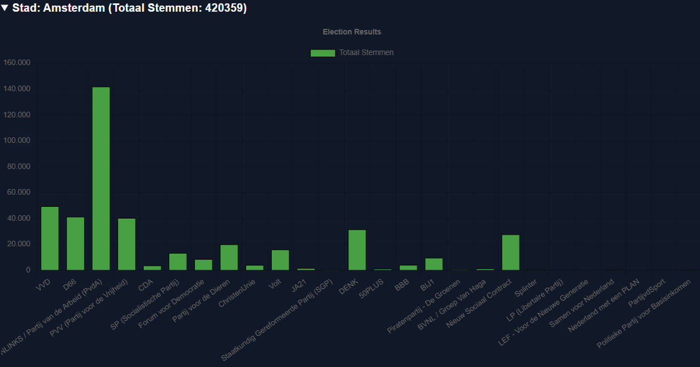

# Kleurcontrast
Het contrast tussen de kleur van tekst en de achtergrond is erg belangrijk voor de leesbaarheid van tekst. Vooral voor mensen met visuele beperkingen is dit contrast heel belangrijk zodat tekst leesbaar is. (Kennisbank DigiToegankelijkheid, 2023)

Om de digitale toegankelijkheid van onze website te verbeteren hebben wij daarom alle tekst in onze website getest op kleurcontrast. Hiervoor hebben wij een contrastchecker gebruikt, in het specifiek die van Coolors (https://coolors.co/contrast-checker/).

Wij hebben de volgende eisen aangehouden voor kleurcontrast (Kennisbank DigiToegankelijkheid, 2023):

- Alle tekst kleiner dan 24px moet een kleurcontrast hebben van minimaal 4,5:1
- Alle tekst groter dan 24px moet een kleurcontrast hebben van 3,0:1
- Alle tekst vanaf 18,7px die ook vetgedrukt is (een `font-weight` van minimaal `700`) moet een kleurcontrast hebben van 3,0:1

Vervolgens hebben wij alle stukken tekst op onze website getest. Het grotendeel van onze website is zwarte tekst op een witte achtergrond, en dus heel goed leesbaar. Wij hadden een paar stukken tekst die wel aangepast moeten worden, zoals hier:

*De lichte tekst in deze afbeelding was eerst nog lichter, en had daarom de kleurcontrast-test niet gehaald. De tekst is nu donkerder om de leesbaarheid te verbeteren*

## Donkere modus
Een andere toegankelijksfunctie op onze website is onze donkere modus. Deze wijzigt alle kleuren op onze website zodat deze donkerder zijn. Ook hiervoor hebben wij opnieuw alle stukken tekst getest, en gewijzigd waar nodig.

## Bronnen

- Kennisbank DigiToegankelijkheid. (2023, 2 november). Kleurcontrast van tekst: WCAG-richtlijnen voor optimale zichtbaarheid. https://kennisbank.digitoegankelijk.nl/voldoende-contrast-van-tekst/#:~:text=Tekst%20kleiner%20dan%2018pt%20(24px,teksten%20in%20afbeeldingen%20en%20video's.