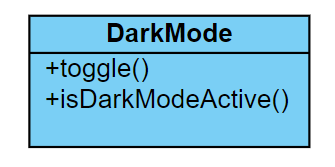

# Donkere modus
De donkere modus staat gebruikers toe om de website te gebruiken in donkere kleuren.

## Technische kant
Ondersteuning voor donkere modus is relatief simpel. Wij gebruiken TailwindCSS in ons project, en gebruiken daarom ook de ingebouwde dark-mode tools van TailwindCSS. (Zie de documentatie: https://tailwindcss.com/docs/dark-mode) Wij gebruiken de `class` modus, en dus niet de `media` modus, zodat wij gebruikers de optie kunnen geven om de donkere modus aan en uit te schakelen.

Om de donkere modus van TailwindCSS te activeren hebben wij de `DarkMode`-class. Wanneer je een instantie aanmaakt van deze class, wordt automatisch de voorkeur van de gebruiker geladen en wordt de pagina in de juiste modus gezet.

De gebruiker kan de donkere modus ook aan of uit zetten, door middel van een knop in het menu. Deze knop roept de `toggle()` functie op.

*UML-diagram voor de donkere modus.*

## Visuele kant
Zie hieronder een voorbeeld van de donkere modus:

